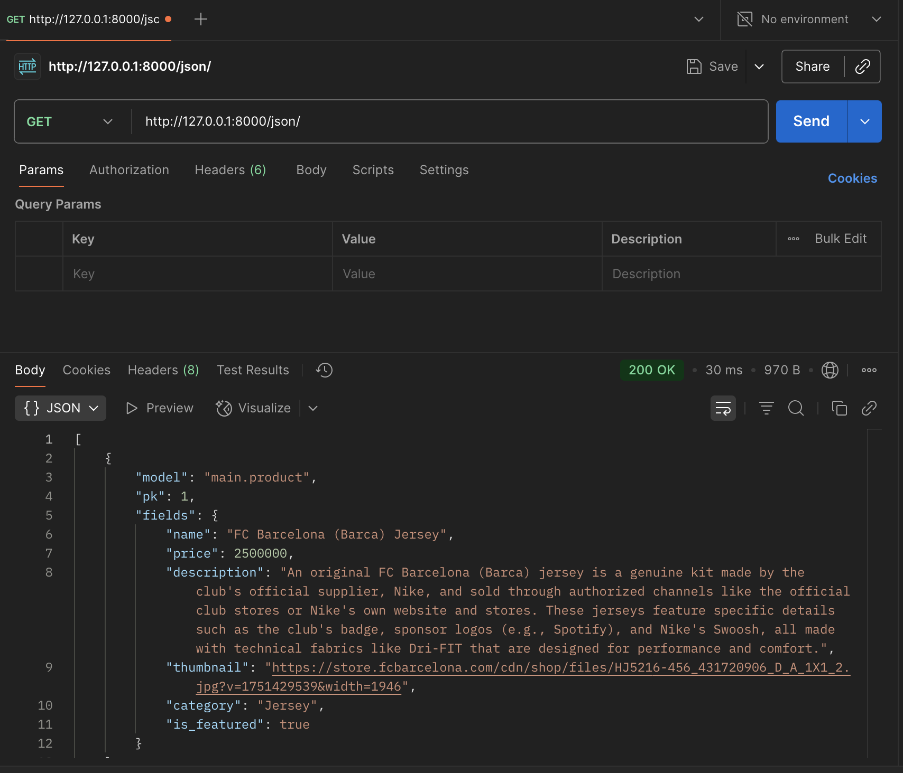
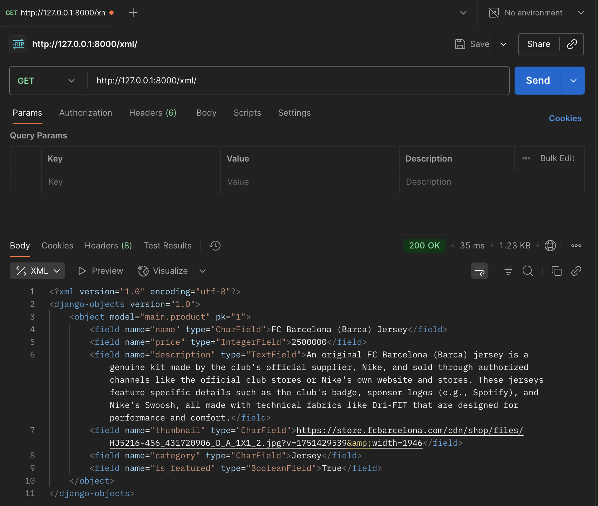
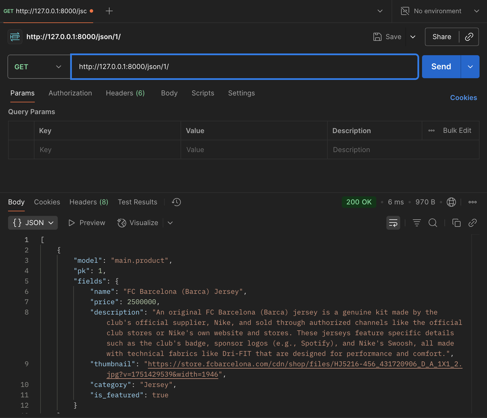

# Football Shop

**Deployed Application:** [https://roben-joseph-footballshop.pbp.cs.ui.ac.id]

---

# **Assignment 5:**

> **Note:** This section contains my work for Assignment 5.  
> The original Assignment 2, 3, and 4 answers follows after the the assignment 5.

---

## 1. CSS Selector Priority: If multiple CSS selectors target an HTML element, explain the priority order for CSS selector selection.

When multiple CSS rules match the same element, browsers decide using **specificity and source order**.  

**Order of priority (highest → lowest):**
1. `!important` rules  
2. Inline styles (`style=""`)  
3. ID selectors (`#id`)  
4. Class, attribute, pseudo-class selectors (`.btn`, `[type=text]`, `:hover`)  
5. Element and pseudo-element selectors (`div`, `p`, `::before`)  
If two have the same specificity, the **last one in code** wins.  

---

## 2. Responsive Design:

Why is responsive design important in web application development?

Responsive design makes a website automatically adjust its layout, images, and components so it works well on any device size (phone, tablet, laptop, or large monitor).

   Why it matters:

- Better user experience: Visitors don’t need to zoom or scroll awkwardly; everything fits their screen.
- SEO benefits: Search engines like Google rank mobile-friendly sites higher.
- Future-proofing: New devices (foldables, tablets, wide screens) can display the site without building a separate version.
- Easier maintenance: One responsive codebase instead of managing separate desktop and mobile websites.

Examples + Explanation:

- Good implementations (Nike, Adidas, Amazon):
   - Nike and Adidas use flexible image grids that shrink or expand depending on screen size.
   - Amazon adjusts menus into hamburger icons on mobile and optimizes product listings into one-column scroll.
   - The result is smooth shopping whether on a big desktop monitor or a small phone.

- Poor implementation (Older Craigslist, some government sites):
   - Craigslist’s old design looks the same on desktop and mobile, forcing users to zoom and scroll horizontally.
   - Text and buttons are tiny, making navigation frustrating.
   - This shows the risk of not using responsive design: the site feels outdated and hard to use.

---

## 3. Box Model

Each HTML element is essentially a box made up of:

- **Content** → the actual text or image inside the element.  
- **Padding** → space between the content and the border (inside the element).  
- **Border** → a visible outline surrounding the padding.  
- **Margin** → space outside the border, separating the element from others.  

**Example:**

```css
.card {
  width: 300px;
  padding: 16px;   /* inside */
  border: 1px solid #ddd;
  margin: 12px;    /* outside */
  box-sizing: border-box;
}
```
---

## 4. Layout Systems: Flexbox and Grid

### Flexbox
- A one-dimensional layout system (works in either a row or a column).  
- Useful for navbars, aligning buttons, or inline elements like price and actions in product cards.  

**Example:**
```css
.container {
  display: flex;
  justify-content: space-between;
  align-items: center;
}
```

### Grid
- A two-dimensional layout system (rows and columns).
- Ideal for product listings, galleries, or complex page layouts.

**Example:**
```css
.container {
  display: grid;
  grid-template-columns: repeat(auto-fit, minmax(240px, 1fr));
}
```

---

## 4. Implementation Steps:

### Setup & Styling
- Added Tailwind via CDN and `global.css` for custom form styles.
- Switched color scheme from green to black/gray for a clean, bold look.

### Product CRUD
- **create_product:** assigns `product.user = request.user`.
- **edit_product & delete_product:** restricted to owners only.

### Templates
- **navbar.html:** responsive navigation with desktop + mobile menu.
- **card_product.html:** redesigned cards with clickable image, product info, price, and inline buttons.

### Responsive Layout
- Used Tailwind grid utilities for the product list.
- Buttons and forms styled with consistent spacing and hover states.

### Ownership Fix
- Ensured that product actions are limited to the product owner.

---

# **Assignment 4:**

> **Note:** This section contains my work for Assignment 4.  
> The original Assignment 2 and 3 answers follows after the the assignment 4.

---

## 1. What is Django's `AuthenticationForm`? Explain its advantages and disadvantages.

AuthenticationForm is a built-in Django form (in django.contrib.auth.forms) that handles username/password login validation and integrates with Django’s authentication helpers (authenticate() or login()).

How it works (brief):

   - It exposes username and password fields.
   - When instantiated with request data and validated (form.is_valid()), it checks credentials and sets form.get_user() to the authenticated User instance (or returns errors if invalid/inactive).

Advantages:

   - Fast to use: you can add login in minutes without writing field validation.
   - Integrates with Django auth: works out-of-the-box with authenticate() and login().
   - Secure defaults: uses Django’s auth back-end and standard error handling.

Disadvantages:

   - Basic fields only: only supports username/password out of the box (not email login, 2FA, or extra fields).
   - UI not provided: you must write templates/HTML for the form.
   - Customization requires subclassing: to change validation, labels, error messages, or to add fields you must subclass or wrap it.

---

## 2. What is the difference between authentication and authorization? How does Django implement the two concepts?

Authentication (AuthN) (Who are you?):

   - Purpose: Verify identity (login).
   - Example: You enter username + password and the system confirms you are user `roben`.

Authorization (AuthZ) (What are you allowed to do?):

   - Purpose: Control access to resources and actions.
   - Example: Does `roben` have permission to delete a product or access the admin page?

How Django implements them:

Authentication: `django.contrib.auth` provides the `User` model, authentication backends, `authenticate()` to check credentials, and `login()` to create a session for a user. `AuthenticationForm` helps collect credentials and `request.user` gives the current authenticated user in views/templates.

Authorization: Django has:
   - `User.is_staff` and `User.is_superuser` flags.
   - Permissions (model-level and custom) and `user.has_perm('app_label.permission_name')`.
   - Groups to bundle permissions.
   - Decorators / mixins such as `@login_required`, `@permission_required`, and `PermissionRequiredMixin` for class-based views.

---

## 3. What are the benefits and drawbacks of using sessions and cookies in storing the state of a web application?

a. Cookies (client-side small pieces of data):

Benefits:
   - Persist small pieces of info across requests (e.g., theme, language).
   - Automatic: browsers send cookies with each request to the domain.
   - Simple to read/write from server or client (JS).

Drawbacks:
   - Size limit (4KB) and limited number per domain.
   - Stored client-side (can be read or tampered with if not protected).
   - Exposing sensitive data in cookies is insecure.

b. Sessions (server-side state + small session id cookie):

Benefits:
   - Store larger, sensitive state safely on server (user profile, cart, auth state).
   - Only a session id is kept client-side (cookie). Server controls content.
   - Flexible: Django supports DB, cache, or external stores (Redis) for sessions.
   - Easier to revoke server-side (delete session record).

Drawbacks:
   - Requires server-side storage and management (more memory/ops).
   - If you run multiple app servers you need a shared session store.
   - Server-side storage adds complexity for scaling and session cleanup.
   - Stateless (RESTful) APIs often prefer token-based approaches.

---

## 4. In web development, is the usage of cookies secure by default, or is there any potential risk that we should be aware of? How does Django handle this problem?

Are cookies secure by default?
No. Cookies are not secure by default. They can be stolen or misused unless configured correctly.

Main risks:
   - XSS (Cross-Site Scripting): attacker-run JavaScript can read cookies accessible to JS.
   - MITM (Man in the Middle): cookies sent over HTTP can be intercepted.
   - CSRF (Cross-Site Request Forgery): attacker tricks browser to send authenticated requests.
   - Session fixation: attacker forces victim to use a known session id.

How Django helps / recommended settings:
   - `SESSION_COOKIE_HTTPONLY` = `True` --> prevents JS from reading the session cookie (mitigates XSS).
   - `SESSION_COOKIE_SECURE` = `True` —-> cookie only sent over HTTPS (prevents MITM on HTTP).
   - `SESSION_COOKIE_SAMESITE` = `'Lax'` or `'Strict'` —-> reduces cross-site requests that include cookies (helps against CSRF).
   - `CSRF` protection (middleware + `` in forms) —-> defends against CSRF attacks.
   - `login()` rotates session keys (cycle session) —-> helps mitigate session fixation.
   - Use `CSRF_COOKIE_SECURE = True` and `SECURE_BROWSER_XSS_FILTER`, `X_FRAME_OPTIONS` and other security settings in production.

---

## 5. Step-by-step: How I implemented the checklist?

#### Precondition (environment):
   I activated the project’s virtual environment (`.env`) using `source .env/bin/activate` and installed Django. This ensures the project runs in isolation.

#### Step 1 (Connect Product to User):
   In `main/models.py`, I defined a single `Product` model and added a `user = models.ForeignKey(User, on_delete=models.CASCADE, null=True)` field. This links products to their authors.  

   I then ran `python3 manage.py makemigrations` and `python3 manage.py migrate`. This fixed earlier errors where two `Product` classes existed.

#### Step 2 (Create ProductForm):
   In `main/forms.py`, I created a `ProductForm` that includes only valid fields (`name`, `price`, `description`, `thumbnail`, `category`, `is_featured`). This solved issues where the form referenced missing fields.

#### Step 3 (Register, Login, and Logout (with cookies)):
   - **Register:** Used Django’s `UserCreationForm`. After registration, users are redirected to login.  
   - **Login:** Used `AuthenticationForm` and Django’s `login()`. On success, I set a `last_login` cookie to record login time.  
   - **Logout:** Called `logout()` and deleted the `last_login` cookie.  

   This integrates with Django sessions securely while also meeting assignment requirements.

#### Step 4 (Protect pages with `login_required`):
   I decorated views such as `show_main` with `@login_required(login_url="/login")`. This redirects unauthenticated users to the login page. In `show_main`, the context includes `username`, the list of `products`, and `last_login`.

#### Step 5 (Link created objects to the logged-in user):
   When saving a product, I used `form.save(commit=False)`, attached `request.user` as the product’s author, then saved it. This ensures products are always tied to the user who created them.

#### Step 6 (Update templates):
   - In `main.html`, I added filter buttons (All Products / My Products) and displayed product details along with their authors.  
   - In `product_detail.html`, I displayed the product’s author or “Anonymous” if no user is linked.  
   - In `login.html` and `register.html`, I ensured `` is present inside forms for CSRF protection.

#### Step 7 (Create dummy data):
   Using the Django shell (`python3 manage.py shell`), I created two users and gave each three products. This satisfied the assignment requirement.

#### Step 8 (Run and verify):
   I started the server with `python3 manage.py runserver`.  
   - If not logged in, I was redirected to the login page.  
   - After logging in, the homepage displayed my username and last login time.  
   - I confirmed in browser dev tools that `sessionid` and `last_login` cookies were set.

#### Step 9 (Optional tests):
   Django supports functional tests with Selenium. Running `python manage.py test` would execute them, though setup is required.

#### Step 10 (Security reminders):
   In `settings.py`, I configured secure cookie settings:  
      - `SESSION_COOKIE_HTTPONLY = True`  
      - `SESSION_COOKIE_SAMESITE = "Lax"`  
      - `CSRF_COOKIE_SAMESITE = "Lax"`  
      - In production: `SESSION_COOKIE_SECURE = True` and `CSRF_COOKIE_SECURE = True`  

#### Step 11 (Push to GitHub):
I staged, committed, and pushed changes with:  
`git add .`, `git commit -m "Assignment 4: auth (register/login/logout), product-user link, last_login cookie, templates"`, and `git push origin master`.

---

# **Assignment 3:**

> **Note:** This section contains my work for Assignment 3.  
> The original Assignment 2 answers follows after the the assignment 3.

---

## 1. Why do we need data delivery in implementing a platform?

Data delivery (exposing application data as machine-readable formats such as JSON or XML) is essential because it makes an application **composable, automatable, and reusable**:

   - It lets different clients consume the same backend: web pages, single-page apps, mobile apps, other services, or third-party tools can all use the same endpoints.  
   - Data delivery enables integrations, automation, and scaling: analytics systems, external services, or other teams can consume data without relying on the UI.  
   - Practically, this means we can build a web UI now, and later a mobile app or partner integration without changing the core backend.

---

## 2. XML vs JSON - Which is better? Why is JSON more popular?

JSON is the more practical choice for modern web APIs, but XML still has useful features in certain domains.

**Why JSON is generally preferred**
   - **Lightweight and concise.** JSON payloads are smaller and easier to scan than equivalent XML.  
   - **Native mapping to JavaScript objects.** Web apps (and many tools) can parse JSON directly into usable objects (`JSON.parse()`), which speeds development.  
   - **Cleaner syntax.** No closing tag verbosity; easier to read and write.  
   - **Ecosystem and tooling.** Modern web frameworks and libraries expect or generate JSON by default.

**When XML is still useful**
   - XML supports attributes, mixed content, namespaces, and formal schema validation. These strengths make XML suitable for document-centric or some enterprise systems (e.g., legacy integrations, complex document formats).

**Conclusion:** For REST-style APIs and most web/mobile needs, JSON’s simplicity and native integration with JavaScript make it the better default. The course slides provide comparison context and historical reasons behind JSON’s rise.

---

## 3. What does `is_valid()` do in Django forms, and why do we need it?

`is_valid()` performs validation and cleaning of form input:

   - When you call `form.is_valid()` Django:
   - Runs each field’s validators (required flags, type checks, custom validators).
   - Converts and cleans raw input into Python types and stores them into `form.cleaned_data`.
   - Populates `form.errors` if validation fails and returns `False`.
   - Returns `True` when all validation checks pass.

**Why this matters**
   - It prevents invalid or malicious data from being saved into the database.
   - It centralizes validation logic (field validators, `clean_<field>()`, and `clean()`).
   - Always call `is_valid()` before using `form.cleaned_data` or calling `form.save()`.

---

## 4. Why do we need `` in Django forms? What happens without it?

**What CSRF protection prevents**
   - CSRF (Cross-Site Request Forgery) protects authenticated users from unwanted actions triggered by third-party pages.  
   - If a user is logged into `example.com`, a malicious page could cause the browser to submit a POST request to `example.com` (using the user's cookies), performing actions on their behalf. unless the server verifies the request's origin.

**How Django defends**
   - Django includes `CsrfViewMiddleware` by default and expects every POST form to include a token generated per user session.
   - In templates, we add `` inside `<form method="post">` so the token goes into the POST body and Django can verify it.

**What happens if we don't include CSRF protection**
   - Attackers can craft hidden forms or image requests that force the victim’s browser to perform state-changing actions (create/delete/update).  
   - Example exploit: a malicious page auto-submits a form to `example.com/transfer/` making the victim unknowingly transfer funds or change their account settings.

**Mitigations beyond ``**
   - Keep `CsrfViewMiddleware` enabled (default).
   - For AJAX, send the token in a header (example: `X-CSRFToken`) or use fetch/fetch wrappers that include it.
   - Use `SameSite` cookie settings to further reduce cross-site request risk.

---

## 5. How I implemented the checklist — step-by-step (not just following the tutorial)

### A — Summary of what I added:
1. **Four data endpoints** to return products in XML and JSON:
   - `/api/products/json/` → all products (JSON)
   - `/api/products/xml/` → all products (XML)
   - `/api/products/json/<id>/` → single product by id (JSON)
   - `/api/products/xml/<id>/` → single product by id (XML)

2. **HTML pages**:
   - A **product list** page showing all products with an **Add** button and a **Detail** link for each product.
   - A **product add** page with a form to create new products.
   - A **product detail** page that displays one product’s data.

3. **Form**:
   - A `ProductForm` (`main/forms.py`) implemented as a **ModelForm** for easy validation and saving.

4. **Routing**:
   - URL patterns added to `main/urls.py` for both the HTML pages and the API endpoints.
   - Project `football_shop/urls.py` includes the `main` app’s URLs.

5. **Validation & security**:
   - The add form uses `form.is_valid()` to validate inputs before saving.
   - Templates use `` to protect POST requests.

### B — Files I created or edited:
   - `main/forms.py` — `ProductForm` (ModelForm)
   - `main/views.py` — added:
   - `api_products_json`, `api_products_xml`, `api_product_json`, `api_product_xml` (these use `django.core.serializers.serialize()` to return XML/JSON)
   - `product_list`, `product_detail`, `product_add` (HTML views)
   - `main/urls.py` — added routes for API + pages
   - `main/templates/main/product_list.html` - shows list + Add + Detail links
   - `main/templates/main/product_form.html` — form to add product (includes ``)
   - `main/templates/main/product_detail.html` — display single product details

### C — Implementation notes & small decisions:
   - I used **Django serializers** (`serializers.serialize("json", queryset)`) for consistent, simple JSON/XML output. This is quick for small projects and ensures field names match model fields.
   - For the HTML add form, I used `ModelForm` from the 2nd tutorial so validation and saving are straightforward.

---

## Feedback for Tutorial 2
   
   Overall the tutorial was very useful and practical, the hands-on exercises helped me understand forms and basic API endpoints. I think it would be way better if:

      - Add a short troubleshooting checklist for common deployment problems (requirements.txt placement, branch mismatch on PWS, Procfile basics).
      - A quick demo showing the same action performed via a Django form and via a JSON API (Postman) would make the conceptual difference clearer for us.

---

## Postman Testing & Screenshots

### JSON list


### XML list


### JSON by ID


### XML by ID


---


# **Assignment 2:**

> **Note:** This section contains my work for Assignment 2.  
> The Assignment 3 answers are abvailable above.

---

## 1. Step-by-Step Implementation

I implemented the Django project by following a checklist, but I made sure I actually understood each step and adapted it to my own workflow. Here’s how it went:

1. **Project Initialization**
   
   I started by setting up the project environment. First, I created a fresh Django project using `django-admin startproject football_shop`.

   To keep everything organized and avoid dependency issues, I also created a virtual environment `python -m venv env` and activated it. Inside this environment, I installed all the required dependencies listed in `requirements.txt`. This way, my project had a clean and isolated setup.

2. **App Creation**  
   
   Once the project structure was ready, I created the core app for my project with `python manage.py startapp main`.
   
   Then, I registered `main` in the`INSTALLED_APPS` section of `settings.py` so Django could recognize and use it.

3. **URL Routing**  
   
   For the URLs, I wanted to keep things modular. I created a separate `urls.py` file inside the `main` app and set up all the routes there. Then, in the main `football_shop/urls.py`, I included those routes so the app and project were properly connected. This made the project structure cleaner and easier to scale.

4. **Views and Templates**  
   
   I worked on building the logic inside `views.py` to handle different requests. For each view, I created corresponding HTML templates inside `main/templates/main/`. This followed Django’s MTV (Model–Template–View) pattern and made sure everything lined up logically, views handled the logic, while templates handled the presentation.

5. **Models and Database**  
   
    Next, I designed my models inside `models.py` to represent the data I wanted to store. After defining the models, I applied them to the database with `python manage.py makemigrations` and `python manage.py migrate`. 
    
    To double-check everything worked, I opened the Django admin panel and verified that the tables and records matched my expectations.

6. **Static Files**  
   
   For local development, Django automatically serves static files when `DEBUG=True`. Since this project is primarily for learning purposes and small-scale deployment, I relied on Django’s built-in static file handling during development. No additional configuration was added.

7. **Deployment to PWS**  
   
   Finally, I prepared the project for deployment. I made sure my `requirements.txt` included everything needed (django, gunicorn, whitenoise, etc.), then pushed my local repository to the PWS GitLab remote with `git push pws master`. In some cases, when my local branch was still named main, I used `git push pws main:master` to match the remote branch.
   
   There were some issues along the way. For example, the project didn’t build at first because my requirements.txt wasn’t included properly. To fix it, I double-checked that all the necessary files were committed and pushed, then retried the deployment. After that, the app finally ran successfully on PWS.

---

## 2. Django Request-Response Flow Diagram

Below is the flow of a client request to a Django web application:

```
        HTTP Request
              |
              v
        +-------------+
        |   URLS      |   (urls.py)
        +-------------+
              |
              | Forward request
              v
        +-------------+
        |   View      |   (views.py)
        +-------------+
         /     |      \
        /      |       \
       v       v        v
+-------------+  +---------------+
|   Model     |  |  Template     |
| (models.py) |  | (<file>.html) |
+-------------+  +---------------+
     ^                |
     |  read/write    |  Render HTML
     |     data       v
     +----------------+
              |
              v
        HTTP Response (HTML)
```

### Explanation:
- **urls.py**: Acts as a router. It decides which view function should handle the incoming request.  

- **views.py**: Contains the logic. It processes requests, interacts with models, and returns responses.  

- **models.py**: Defines the data structure and communicates with the database.  

- **HTML Templates**: Present the final output to the user, filled with data passed from the view.  

### Analogy: A Company Visit
- **urls.py** → The Receptionist:
Decides which office (view) the visitor should go to based on the URL.

- **views.py** → The Office Worker:
Handles the visitor’s request, talks to the filing cabinet, and prepares a response.

- **models.py** → The Filing Cabinet:
Stores and retrieves data (database).

- **HTML Templates** → The Brochure:
The final presentation handed back to the visitor.

---

## 3. The Role of `settings.py`

Think of `settings.py` as the **control center** of your Django project. Almost everything your project does looks here for instructions. Some of the key things it manages:

- **Database configuration** → tells Django which database to use (SQLite, PostgreSQL, MySQL, etc.) and how to connect.  
- **Installed apps** → lists all the Django apps (both built-in and custom) that your project needs.  
- **Middleware** → defines a chain of hooks that process requests and responses (e.g., authentication, security, sessions).  
- **Templates and static files** → where Django should look for HTML templates, CSS, JavaScript, and images.  
- **Sensitive settings** → things like `SECRET_KEY`, API keys, and database credentials. In real projects, these are usually stored as environment variables instead of hardcoding them.  
- **Debugging and security** → `DEBUG=True` for development shows detailed errors, while in production you switch it off and configure `ALLOWED_HOSTS` to specify which domains can serve your site.  

In short, `settings.py` is the **instruction manual** that Django follows every time the server runs.

---

## 4. Database Migration in Django

Migrations in Django translate changes in `models.py` into actual database schema updates:
1. `python manage.py makemigrations` → creates migration files that describe changes.  
2. `python manage.py migrate` → applies the changes to the database.  

This ensures the database stays synchronized with the Python model definitions while preserving existing data.

---

## 5. Why Django as a Starting Framework?

Django is often recommended for beginners and professionals alike because it balances power with simplicity:

- **Batteries included** philosophy:
Out of the box, Django gives you a powerful ORM, authentication system, form handling, session management, admin dashboard, and much more. You don’t have to reinvent the wheel.

- **Encourages good structure**:
Django follows the MVT (Model–View–Template) architecture. This separation of concerns helps beginners understand how web apps are organized and makes the project easier to maintain as it grows.

- **Scales with you**:
You can start small (a personal blog, a simple API) and later scale up to enterprise-level applications (Django powers Instagram, Pinterest, Disqus).

- **Strong community & documentation**
Django’s documentation is considered one of the best in open source. On top of that, the community is huge, meaning plenty of tutorials, StackOverflow answers, and open-source packages to help you. For beginners, Django reduces the complexity of setting up a web application while teaching best practices.

---

## 6. Feedback for Tutorial 1

I really appreciated that the TAs explained each step patiently with a very clear and straight-forward instructions.

Some feedback:  
- It would be great if more real-world examples were provided (e.g., why we need migrations in practice).  
- Sometimes the pace felt a bit fast, especially during trickier parts like setting up the database or running migrations. It might help to slow down at those points, give a little extra explanation, or pause for questions so everyone can follow along. 

Overall, it was a helpful and enjoyable session! 🙌

---